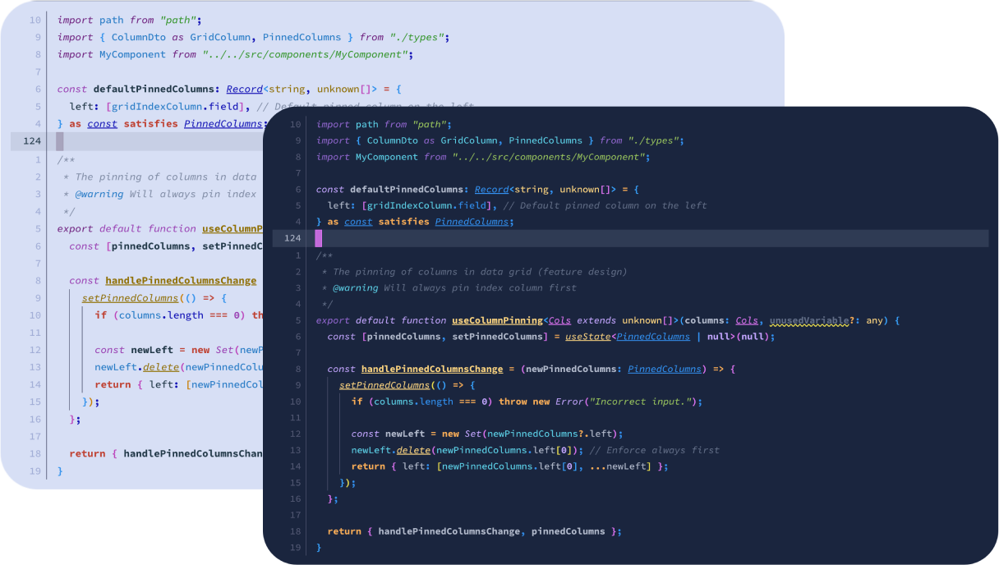

> [!CAUTION]
> Remember - **Halender is in pre-alpha mode!** Documentation is still under construction

&nbsp;

  

<h3 align="center">
 Halender
</h3>

<h6 align="center">
  <a href="https://github.com/deniskabana/halender#-ports">Ports</a>
  ·
  <a href="https://github.com/deniskabana/halender#-palette">Palette</a>
  ·
  <a href="https://github.com/catppuccin/catppuccin/tree/main/dev">Development</a>
  ·
  <a href="#">Playground</a>
</h6>

&nbsp;

  

&nbsp;

### 📀 Ports

<h5>Editors</h5>
<h6>
  <ul>
    <li>
      
      <a href="./editors/nvim/">Neovim</a>
    </li>
    <li>
      
      <a href="./editors/vscode/">VSCode</a>
      <i>(coming soon)</i>
    </li>
  </ul>
</h6>

<h5>Terminals</h5>
<h6>
  <ul>
    <li>
      
      <a href="./terminals/kitty/">Kitty</a>
    </li>
    <li>
      
      <a href="./terminals/ghostty/">Ghostty</a>
    </li>
    <li>
      
      <a href="./terminals/iterm2/">iTerm 2</a>
    </li>
    <li>
      
      <a href="./terminals/apple-terminal/">Apple&nbsp;terminal</a>
    </li>
  </ul>
</h6>

&nbsp;

### 🧠 Design Philosophy

- **Colorful is better than colorless**: the colorfulness of something contributes to the distinction amongst the parts
  of that _something_, making it marginally easier to understand how things are structured.
- **There should be balance**: not too dull, not too bright. Suitability under various light conditions is a must.
- **Harmony is superior to dissonance**: vivacious colors must complement each other.
- **Contrast and priority correlation**: use visual recognition patterns to convey the importance of elements.

_Heavy inspiration taken from the [Catpuccin](https://github.com/catppuccin/catppuccin) project._

&nbsp;

### 🎨 Palette

<!-- GEN:PALETTE:START -->

<strong>🌙 Dark mode</strong>

 
<table>
  <tr>
    <th>Color</th>
    <th>Hex</th>
    <th>Name</th>
    <th>Group</th>
    <th>Description</th>
  </tr>
  <tr>
    <td></td>
    <td><code>#ef6b73</code></td>
    <td><strong>Crimson</strong></td>
    <td>Accent</td>
    <td><i>TBD</i></td>
  </tr>
  <tr>
    <td></td>
    <td><code>#cf3a3c</code></td>
    <td><strong>Ruby</strong></td>
    <td>Accent</td>
    <td><i>Error, Danger, Critical action</i></td>
  </tr>
  <tr>
    <td></td>
    <td><code>#ffae57</code></td>
    <td><strong>Amber</strong></td>
    <td>Accent</td>
    <td><i>Number, Operators, Decisive keyword (e.g. return)</i></td>
  </tr>
  <tr>
    <td></td>
    <td><code>#ffd580</code></td>
    <td><strong>Gold</strong></td>
    <td>Accent</td>
    <td><i>Function, Method, Primary accent</i></td>
  </tr>
  <tr>
    <td></td>
    <td><code>#eFE24D</code></td>
    <td><strong>Citrine</strong></td>
    <td>Accent</td>
    <td><i>Warning, CTA</i></td>
  </tr>
  <tr>
    <td></td>
    <td><code>#a7d963</code></td>
    <td><strong>Lime</strong></td>
    <td>Accent</td>
    <td><i>String</i></td>
  </tr>
  <tr>
    <td></td>
    <td><code>#4aaa45</code></td>
    <td><strong>Forest</strong></td>
    <td>Accent</td>
    <td><i>Success, Positive action</i></td>
  </tr>
  <tr>
    <td></td>
    <td><code>#5ccfe6</code></td>
    <td><strong>Cyan</strong></td>
    <td>Accent</td>
    <td><i>Property, Parameter, Argument, Member</i></td>
  </tr>
  <tr>
    <td></td>
    <td><code>#2190f0</code></td>
    <td><strong>Azure</strong></td>
    <td>Accent</td>
    <td><i>Type, Class, Interface, Namespace, Accessed property</i></td>
  </tr>
  <tr>
    <td></td>
    <td><code>#2Ea3FF</code></td>
    <td><strong>Cobalt</strong></td>
    <td>Accent</td>
    <td><i>TBD, CTA</i></td>
  </tr>
  <tr>
    <td></td>
    <td><code>#c3a6ff</code></td>
    <td><strong>Lavender</strong></td>
    <td>Accent</td>
    <td><i>Keyword, Control flow, Loop, Conditional</i></td>
  </tr>
  <tr>
    <td></td>
    <td><code>#9066ce</code></td>
    <td><strong>Amethyst</strong></td>
    <td>Accent</td>
    <td><i>Secondary keyword (e.g. include), Built-in members</i></td>
  </tr>
  <tr>
    <td></td>
    <td><code>#dc73f1</code></td>
    <td><strong>Magenta</strong></td>
    <td>Accent</td>
    <td><i>Decorator, Generic Type, Uncommon keyword, Secondary accent, CTA</i></td>
  </tr>
</table>

<strong>🔅 Light mode</strong>

 
<table>
  <tr>
    <th>Color</th>
    <th>Hex</th>
    <th>Name</th>
    <th>Group</th>
    <th>Description</th>
  </tr>
  <tr>
    <td></td>
    <td><code>#cf2a2c</code></td>
    <td><strong>Crimson</strong></td>
    <td>Accent</td>
    <td><i>TBD</i></td>
  </tr>
  <tr>
    <td></td>
    <td><code>#cf2a2c</code></td>
    <td><strong>Ruby</strong></td>
    <td>Accent</td>
    <td><i>Error, Danger, Critical action</i></td>
  </tr>
  <tr>
    <td></td>
    <td><code>#bf4030</code></td>
    <td><strong>Amber</strong></td>
    <td>Accent</td>
    <td><i>Number, Operators, Decisive keyword (e.g. return)</i></td>
  </tr>
  <tr>
    <td></td>
    <td><code>#907002</code></td>
    <td><strong>Gold</strong></td>
    <td>Accent</td>
    <td><i>Function, Method, Primary accent</i></td>
  </tr>
  <tr>
    <td></td>
    <td><code>#c98005</code></td>
    <td><strong>Citrine</strong></td>
    <td>Accent</td>
    <td><i>Warning, CTA</i></td>
  </tr>
  <tr>
    <td></td>
    <td><code>#339425</code></td>
    <td><strong>Lime</strong></td>
    <td>Accent</td>
    <td><i>String</i></td>
  </tr>
  <tr>
    <td></td>
    <td><code>#4aaa45</code></td>
    <td><strong>Forest</strong></td>
    <td>Accent</td>
    <td><i>Success, Positive action</i></td>
  </tr>
  <tr>
    <td></td>
    <td><code>#007ac5</code></td>
    <td><strong>Cyan</strong></td>
    <td>Accent</td>
    <td><i>Property, Parameter, Argument, Member</i></td>
  </tr>
  <tr>
    <td></td>
    <td><code>#0010b5</code></td>
    <td><strong>Azure</strong></td>
    <td>Accent</td>
    <td><i>Type, Class, Interface, Namespace, Accessed property</i></td>
  </tr>
  <tr>
    <td></td>
    <td><code>#2590EC</code></td>
    <td><strong>Cobalt</strong></td>
    <td>Accent</td>
    <td><i>TBD, CTA</i></td>
  </tr>
  <tr>
    <td></td>
    <td><code>#9a40b3</code></td>
    <td><strong>Lavender</strong></td>
    <td>Accent</td>
    <td><i>Keyword, Control flow, Loop, Conditional</i></td>
  </tr>
  <tr>
    <td></td>
    <td><code>#6f1f7f</code></td>
    <td><strong>Amethyst</strong></td>
    <td>Accent</td>
    <td><i>Secondary keyword (e.g. include), Built-in members</i></td>
  </tr>
  <tr>
    <td></td>
    <td><code>#bc42ba</code></td>
    <td><strong>Magenta</strong></td>
    <td>Accent</td>
    <td><i>Decorator, Generic Type, Uncommon keyword, Secondary accent, CTA</i></td>
  </tr>
</table>

<!-- GEN:PALETTE:END -->
